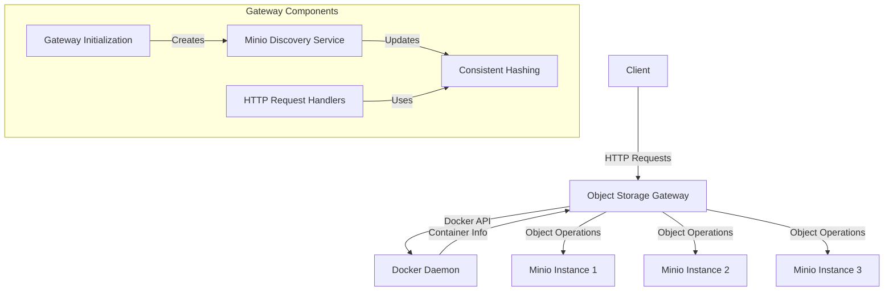
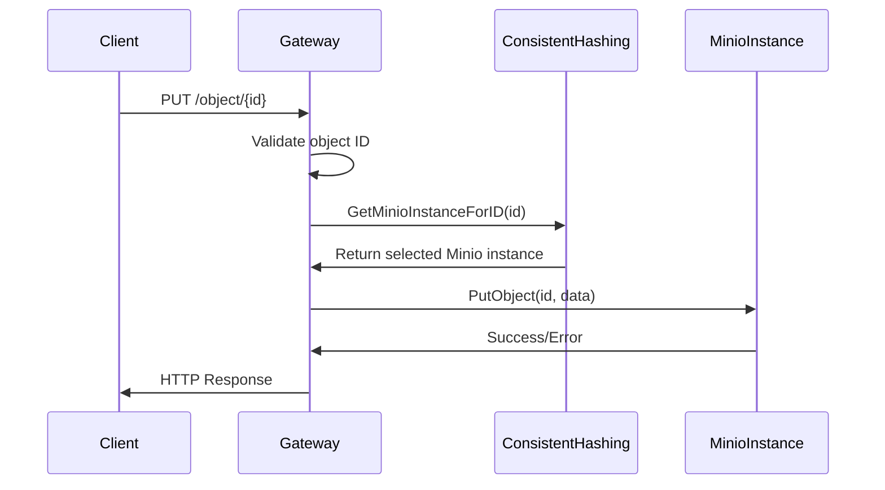
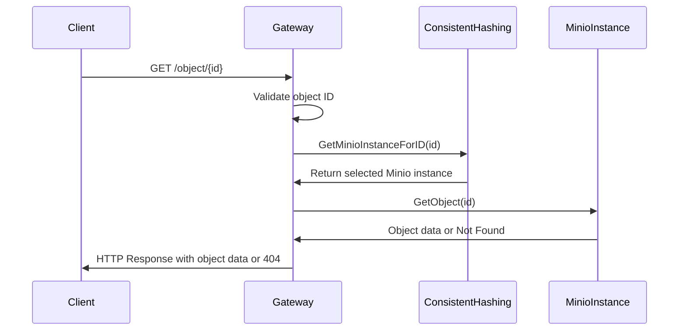
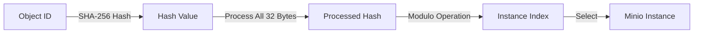

# RFC: Object Storage Gateway Architecture

## 1. Introduction

This document describes the architecture of the Object Storage Gateway, a stateless HTTP gateway that interfaces with multiple Minio Object Storage instances. The gateway provides a unified interface for storing and retrieving objects while distributing them across multiple storage backends using consistent hashing.

## 2. System Architecture

The Object Storage Gateway is designed as a stateless service that dynamically discovers Minio instances running in Docker containers and routes object storage requests to the appropriate instance based on the object ID. This architecture enables horizontal scalability and high availability.

## 3. Component Breakdown

### 3.1 Main Application (`main.go`)

The entry point that:
- Initializes the gateway
- Discovers Minio instances
- Sets up HTTP routes
- Starts the HTTP server

### 3.2 Gateway (`gateway.go`)

Core component responsible for:
- Discovering and managing Minio instances using Docker API
- Periodically refreshing the list of available instances
- Implementing consistent hashing to route object requests

Key functions:
- `NewObjectStorageGateway()`: Creates a new gateway instance and discovers Minio instances
- `DiscoverMinioInstances()`: Finds all Minio containers and sets up clients
- `GetMinioInstanceForID()`: Uses consistent hashing to determine which Minio instance to use for a given object ID

### 3.3 Handlers (`handlers.go`)

Implements HTTP request handlers:
- `HandlePutObject()`: Processes PUT requests to store objects
- `HandleGetObject()`: Processes GET requests to retrieve objects

Both handlers:
1. Extract and validate the object ID from the URL
2. Determine the appropriate Minio instance using consistent hashing
3. Perform the operation (store/retrieve) on that instance
4. Return appropriate responses

### 3.4 Validation (`validation.go`)

Contains utility functions:
- `IsValidObjectID()`: Ensures object IDs are alphanumeric and within length limits (0-32 characters)

### 3.5 Models (`types.go`)

Defines data structures:
- `MinioInstance`: Represents a single Minio server with its connection details
- `ObjectStorageGateway`: The main gateway structure holding instances and configuration

## 4. Request Flow

### 4.1 PUT Request Flow

### 4.2 GET Request Flow

## 5. Key Technical Features

### 5.1 Consistent Hashing

The gateway uses SHA-256 hashing of object IDs to consistently map objects to the same Minio instance. This ensures that:
- Objects are evenly distributed across available instances
- The same object ID always maps to the same instance (as long as the set of instances doesn't change)
- When instances are added or removed, only a fraction of objects need to be remapped

The implementation utilizes all 32 bytes of the SHA-256 hash output, divided into 4 uint64 values that are XORed together to achieve optimal distribution.

### 5.2 Dynamic Discovery

The gateway discovers Minio instances at startup and periodically refreshes the list, making it adaptable to changes in the infrastructure. The discovery process:
1. Queries the Docker daemon for containers with "amazin-object-storage-node" in their name
2. Extracts connection details (IP address, access keys) from container metadata
3. Creates and configures Minio clients for each instance
4. Ensures required buckets exist on each instance

### 5.3 Stateless Design

The gateway maintains no persistent state of its own, making it horizontally scalable. All state is maintained in the Minio instances themselves.

### 5.4 Error Handling

Comprehensive error handling ensures the application is robust against failures:
- Connection failures to Minio instances
- Invalid object IDs
- Missing objects
- Docker API errors

### 5.5 Concurrency Safety

Uses mutex locks to ensure thread-safe access to shared resources, particularly the list of Minio instances that may be updated by the background refresh process.

## 6. Conclusion

The Object Storage Gateway provides a scalable, reliable object storage system that distributes objects across multiple storage instances while maintaining consistency. Its stateless design and dynamic discovery capabilities make it well-suited for containerized environments where the underlying infrastructure may change over time.
